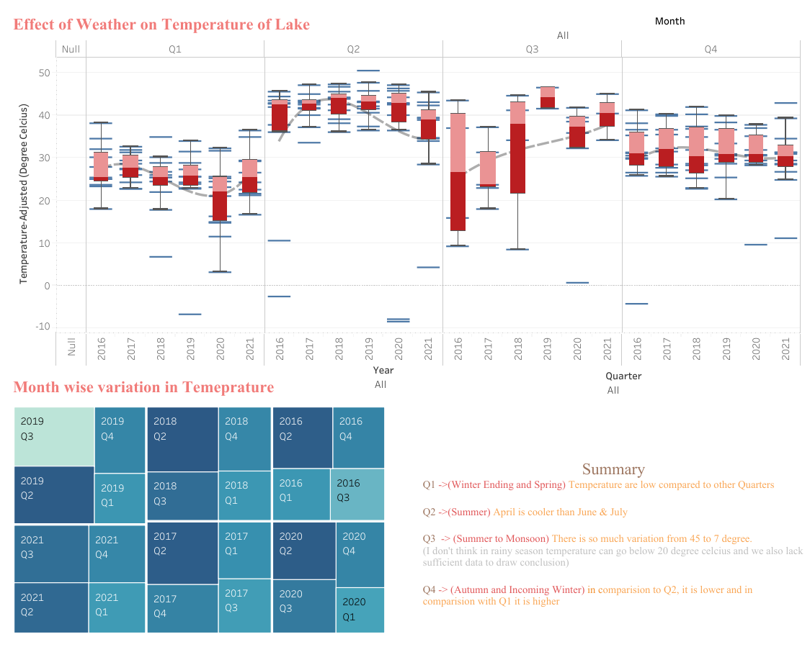

# Monetoring Water Quality Using GIS System In Bhopal Region
This is Streamlit Deployment of the Omdena Project on Water Quality Analysis of Bhopal Lake using GIS & satellite Imagery
I have deployed this project in the main website of this project, you can see the Web-App in the website Section of this repo.
<a href="https://demon-2-angel-omdenavitb-wqa-stre-streamlit-with-tableau-dfdikt.streamlit.app/">Visit StreamLit Web-APP</a>

# Integration of Tableau-Dashboard in Streamlit
All examples will be static bcz Markdown only supports Images, not interactive Analysis
{For that you can visit the WebAPP}
<a href="https://public.tableau.com/app/profile/aniruddha.kumar">Visit My Tableau Profile</a>

## Drinking Water Quality Analysis

## Effect of Dissolved Oxygen, Cholrophyll and Trubiduty Analysis of the Lake

## Temperature Analysis of the Bhopal Lake

